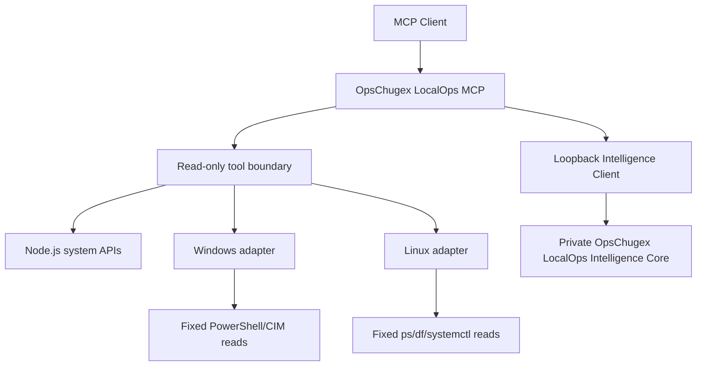

# OpsChugex LocalOps MCP

<!-- mcp-name: io.github.alexcgodwin/localops-mcp -->

[](https://github.com/alexcgodwin/localops-mcp/actions/workflows/ci.yml)
[](LICENSE)
[](server.json)

**Local Infrastructure, Endpoint & Systems Intelligence**

OpsChugex LocalOps MCP is a cross-platform Model Context Protocol server for safely inspecting local Windows and Linux systems. It is designed as the local/private-infrastructure counterpart to the Cloud DevOps MCP Server.

Version 1.1.0 adds Database Intelligence to the production LocalOps platform. PostgreSQL, MySQL/MariaDB, SQL Server and Redis can be inspected through named environment-configured profiles and fixed read-only telemetry queries. Database health, replication, contention and workload-pressure reasoning run through the private OpsChugex LocalOps Intelligence Core. Passwords, connection strings, arbitrary SQL, query text, write operations and transaction termination are not exposed through MCP.

## Why this exists

Cloud operations tools can see cloud resources, deployments and managed services. They often cannot explain what is happening inside a workstation, private server or endpoint.

LocalOps starts at the operating-system layer:

- host and operating-system discovery
- CPU, memory and disk pressure
- network interface inventory
- bounded process inspection
- Windows service and systemd service inspection
- installed software and version inventory
- local users, groups and administrator membership
- startup program and scheduled-task metadata
- certificate and certificate-expiry inventory
- SSH key metadata without key contents
- environment-variable names without values
- local listening ports and active connection evidence
- routing, DNS and firewall configuration summaries
- adapter and ARP/neighbor-cache inventory
- process-to-network mapping without packet contents
- caller-baseline checks for unexpected listeners and outbound endpoints
- bounded Windows Event Log and Linux journal evidence
- login success/failure evidence where the host audit source permits it
- service, account, privileged-group and scheduler change evidence
- Microsoft Defender operational evidence on Windows
- explicit evidence-gap reporting when permissions or audit configuration are insufficient
- caller-baseline service-change detection
- disabled-by-default controlled execution gateway
- exact service allowlisting for service mutations
- five-minute one-time approval tokens
- post-action verification and in-memory audit records
- bounded evidence bundles for private correlation
- authenticated loopback-only private intelligence interface
- process, service, identity, network and persistence correlation
- chronological incident evidence timelines
- evidence-backed probable-cause ranking
- evidence-confidence scoring with source-limit penalties
- root-cause evidence chains
- read-only investigation paths
- temporal change-trigger identification
- local/evidence-based blast-radius analysis
- advisory remediation recommendations with risk tiers
- bounded local fleet snapshots without raw event-log storage
- in-memory node registration and snapshot freshness tracking
- fleet health and inventory summaries
- explicit-baseline node comparison
- configuration, software, patch, certificate and security drift
- local Hyper-V, VirtualBox, Proxmox, libvirt and VMware CLI inventory where available
- exact local VM-state lookup without mutation
- local storage capacity and bounded storage-health evidence
- local Windows battery/UPS or Linux UPower telemetry
- private network-device health from caller-supplied snapshots
- private topology components, isolated nodes, down links and articulation/dependency concentration
- named database profiles without credential exposure
- PostgreSQL, MySQL/MariaDB, SQL Server and Redis read-only telemetry
- normalized database inventory, connection, capacity, replication, lock and workload-pressure evidence
- private database health, replication, contention and pressure reasoning
- normalized Windows/Linux outputs
- explicit R0-R2 safety boundaries with R3+ blocked

The long-term goal is evidence correlation across endpoints, private infrastructure, networking, storage and virtualization while keeping advanced OpsChugex intelligence proprietary.

## v1.1 tools

| Tool | Purpose |
| --- | --- |
| `system_info` | Host, OS, architecture, CPU count and uptime |
| `system_health` | CPU, memory and disk pressure summary |
| `cpu_status` | Sample CPU utilization and processor metadata |
| `memory_status` | Physical memory usage |
| `disk_status` | Fixed-disk capacity and utilization |
| `network_interfaces` | Local adapters and assigned addresses |
| `list_processes` | Bounded process inventory without command lines |
| `inspect_process` | Inspect one process by PID |
| `list_services` | Windows services or systemd units |
| `service_status` | Inspect one validated service name |
| `uptime` | System uptime in seconds, hours and days |
| `installed_software` | Bounded installed-software inventory with versions |
| `software_versions` | Look up versions for requested installed software |
| `software_changes` | Compare current software with a caller-supplied baseline |
| `local_users` | Local account metadata without credentials |
| `local_groups` | Local group metadata and Linux group membership |
| `local_admins` | Built-in Windows administrators or common Linux admin groups |
| `startup_programs` | Startup registration metadata without command lines |
| `scheduled_tasks` | Scheduled-task/timer metadata without action commands |
| `certificate_inventory` | Certificate metadata without private key material |
| `certificate_expiry` | Expired or soon-to-expire certificate evidence |
| `ssh_key_inventory` | SSH-directory file metadata without key contents |
| `environment_variables_summary` | Environment-variable names and sensitivity flags without values |
| `open_ports` | Unique local TCP/UDP listening endpoints without remote scanning |
| `listening_ports` | Local TCP listeners and UDP endpoints with owner metadata |
| `network_connections` | Bounded local TCP/UDP socket state without packet capture |
| `network_routes` | Local routing table |
| `dns_configuration` | Configured DNS servers and search domains |
| `dns_resolution` | Resolve one validated host through the OS resolver |
| `firewall_status` | Local firewall provider/profile state |
| `firewall_rules` | Bounded read-only firewall-rule summary |
| `network_adapters` | Local adapter and link-state inventory |
| `arp_neighbors` | Local ARP/neighbor-cache evidence without active probing |
| `process_network_map` | Group observed sockets by owning process |
| `unexpected_listening_ports` | Compare listeners with a caller-supplied port baseline |
| `unusual_outbound_connections` | Compare active TCP remotes with caller-supplied expectations |
| `windows_event_logs` | Bounded Windows event evidence from an allowlisted log set |
| `linux_journal_logs` | Bounded Linux journal evidence with optional unit/priority filters |
| `security_events` | Supported security-relevant event evidence with audit limitations |
| `login_events` | Successful login/session evidence where available |
| `failed_logins` | Failed authentication evidence where available |
| `service_install_events` | Windows service-install or bounded Linux service-change evidence |
| `account_creation_events` | Local account-creation evidence |
| `admin_group_changes` | Privileged-group membership change evidence |
| `process_creation_events` | Audited Windows process-creation evidence; Linux remains unknown without an explicit audit source |
| `task_scheduler_events` | Scheduled-task/timer event evidence |
| `defender_events` | Microsoft Defender Operational evidence on Windows |
| `recent_system_changes` | Deterministic aggregation of supported system-change evidence |
| `recent_security_changes` | Deterministic aggregation of supported security-change evidence |
| `detect_new_services` | Compare current service names with a caller-supplied baseline |
| `execution_status` | Show execution enablement, allowlist and v0.5 risk-policy state |
| `propose_execution` | Run preflight and issue a five-minute one-time approval token without executing |
| `execute_approved_action` | Execute exactly the action bound to a valid approval token |
| `execution_audit_log` | Read recent in-memory execution audit records without approval tokens |
| `intelligence_status` | Check whether the private loopback intelligence core is configured and reachable |
| `correlate_process_activity` | Correlate bounded process, event and network evidence through the private core |
| `correlate_service_activity` | Correlate service, process, event and network relationships |
| `correlate_identity_activity` | Correlate local identity, admin and authentication/change evidence |
| `correlate_network_activity` | Correlate process-to-remote-endpoint relationships without packet capture |
| `correlate_persistence_signals` | Correlate startup, scheduled-task, service, process and event evidence |
| `build_incident_timeline` | Build a chronological evidence timeline while preserving source limitations |
| `rank_probable_causes` | Rank evidence-backed operational hypotheses through the private core |
| `calculate_confidence` | Measure evidence coverage/confidence without treating it as compromise probability |
| `build_evidence_chain` | Build ordered supporting evidence chains for leading hypotheses |
| `suggest_investigation_path` | Generate an evidence-first, read-only investigation sequence |
| `identify_change_trigger` | Identify the earliest supported timestamped change as a temporal starting point |
| `identify_blast_radius` | Summarize local entities and observed network relationships tied to leading hypotheses |
| `recommend_remediation` | Return advisory risk-tiered remediation options without authorizing execution |
| `capture_node_snapshot` | Capture a bounded normalized snapshot of the current local host |
| `register_node` | Upsert one snapshot into the local in-memory fleet registry |
| `list_nodes` | List registered node metadata and snapshot freshness |
| `node_health` | Show health and freshness for one registered node |
| `fleet_health` | Summarize health, stale snapshots and node states across the registry |
| `fleet_inventory` | Return bounded fleet metadata without raw event logs |
| `compare_nodes` | Compare two registered snapshots through the private core |
| `configuration_drift` | Compare host, service, startup and scheduler state against an explicit baseline |
| `software_drift` | Compare installed-software presence and versions against an explicit baseline |
| `patch_drift` | Compare Windows hotfix or Linux kernel/package patch markers |
| `certificate_drift` | Compare certificate presence and expiry metadata |
| `security_drift` | Compare local-admin and summarized security-change evidence |
| `virtual_machine_inventory` | Inspect locally available Hyper-V, VirtualBox, Proxmox, libvirt or VMware CLI inventory |
| `vm_health` | Inspect one exact local VM ID/name and report observed provider state |
| `storage_capacity` | Summarize local fixed-filesystem capacity and utilization |
| `storage_health` | Combine filesystem utilization with supported local physical-disk health evidence |
| `ups_health` | Read locally exposed Windows battery/UPS or Linux UPower telemetry |
| `network_device_health` | Analyze bounded caller-supplied private-device snapshots through the private core |
| `private_network_topology` | Analyze caller-supplied private-infrastructure nodes/links without discovery or probing |
| `platform_status` | Show v1.0 transport, process-bound identity/role, execution state, durable-audit state and private-core reachability |
| `policy_status` | Show RBAC permissions and the enforced R0-R3+ boundary |
| `evaluate_policy` | Evaluate one operation/risk tier without executing anything |
| `production_readiness` | Check runtime, RBAC, execution/audit coherence, data-directory safety and private-core reachability |
| `production_audit_log` | Read metadata-only durable execution audit records when enabled |
| `database_profiles` | List configured database profile metadata without password values or secret-environment names |
| `database_snapshot` | Collect a bounded normalized read-only snapshot using fixed engine telemetry queries |
| `database_health` | Analyze operational database health through the private intelligence core |
| `database_capacity` | Return database-size or memory-capacity evidence without inventing free-space risk |
| `database_connection_summary` | Return bounded active/total/max/blocked connection evidence |
| `database_replication_health` | Analyze replication role/state/lag evidence without assuming standalone databases are unhealthy |
| `database_lock_summary` | Analyze waiting-lock/blocked-connection contention without terminating transactions |
| `database_query_pressure` | Analyze connection utilization and workload-pressure evidence without collecting query text |

## Architecture



The public MCP owns protocol handling, safe collectors, normalized node/fleet/infrastructure/database schemas, fixed read-only database adapters, local virtualization/storage/power adapters, the in-memory fleet registry, process-bound RBAC/policy enforcement, local execution approvals, optional durable audit storage, the loopback client and operator-facing tools. The private OpsChugex intelligence core owns correlation, root-cause ranking, fleet drift, private device-health/topology reasoning and database health/replication/contention/pressure analysis.

## Quickstart

Requirements:

- Node.js 20 or newer
- Windows 10/11 or a modern Linux distribution
- PowerShell on Windows
- `ps`, `df` and systemd tools for the relevant Linux collectors

Clone and run:

```bash
git clone https://github.com/alexcgodwin/localops-mcp.git
cd localops-mcp
npm install
npm run build
npm test
npm start
```

For development:

```bash
npm run dev
```

### Optional private intelligence core

The v0.6 correlation tools, v0.7 root-cause tools, v0.8 private fleet comparison/drift tools and v0.9 network-device/topology analysis require the private OpsChugex LocalOps Intelligence Core to be running locally. Configure the public MCP process with:

```text
LOCALOPS_INTELLIGENCE_URL=http://127.0.0.1:43123
LOCALOPS_INTELLIGENCE_TOKEN=<private token of at least 32 characters>
```

The public client rejects non-loopback intelligence URLs. If the private core is not configured or running, local collection and policy/readiness tools continue to work and private-analysis tools report the limitation.

### v1.0 production controls

The local stdio process uses process-bound RBAC:

```text
LOCALOPS_ROLE=viewer|operator|maintainer|admin
LOCALOPS_OPERATOR_ID=<local operator/process identity>
LOCALOPS_AUDIT_PERSISTENCE=true|false
LOCALOPS_DATA_DIR=<optional absolute non-root directory>
```

The default role is `viewer`. `operator` may create R2 proposals, while `maintainer` and `admin` may execute an otherwise valid R2 approval. R3+ execution remains unavailable. Durable audit is optional for read-only deployments but `production_readiness` reports execution without durable audit as blocked.

### v1.1 database profiles

Database tools use named profiles from `LOCALOPS_DATABASE_PROFILES`. Profiles contain connection metadata only. Password values are referenced through separate environment variables and are never accepted as MCP tool arguments.

Example:

```text
LOCALOPS_DATABASE_PROFILES=[{"id":"pg-main","engine":"postgresql","host":"127.0.0.1","port":5432,"database":"app","user":"localops_reader","passwordEnv":"LOCALOPS_DB_PG_MAIN_PASSWORD","tls":true}]
LOCALOPS_DB_PG_MAIN_PASSWORD=<secret value>
```

Supported engines are `postgresql`, `mysql` (including MariaDB-compatible telemetry), `sqlserver`, and `redis`.

SQL Server may use `"integratedAuth":true` instead of a password environment variable. Database profile parsing is included in `production_readiness`.

## Safety model

v1.1 keeps the local approval-gated execution boundary, production RBAC/audit controls, and adds read-only database telemetry through named profiles:

```text
R0 READ                     allowed
R1 ANALYZE / EVIDENCE       allowed
R2 BOUNDED EXECUTION         disabled by default; explicit approval required
R3+ HIGHER-RISK EXECUTION    not exposed
PRIVATE INTELLIGENCE          loopback-only, authenticated, analysis-only
FLEET SNAPSHOTS               bounded, in-memory, no remote control
PRIVATE INFRASTRUCTURE         local reads + caller-supplied snapshots only
RBAC / POLICY                  process-bound, enforced for execution
DURABLE AUDIT                  optional metadata-only local JSONL
DATABASE INTELLIGENCE          fixed read-only queries, named profiles only
```

Important controls:

- no arbitrary command tool
- no arbitrary PowerShell or shell input
- no environment-variable values
- no SSH key contents or private-key reads
- no scheduled-task action commands
- no startup command lines
- no process command-line collection
- no remote port scanning
- no packet capture or packet payload inspection
- no firewall changes
- "unexpected", "outside baseline" and "new" mean only that caller-supplied expectations did not match
- no event-log clearing or retention changes
- no audit-policy changes
- event messages are bounded and secret-like values are redacted
- inaccessible logs and missing audit coverage are reported as evidence limitations rather than interpreted as clean
- execution is disabled unless `LOCALOPS_EXECUTION_ENABLED=true`
- least-privileged default role is `viewer`
- R2 proposals require `operator`, `maintainer`, or `admin`
- R2 execution requires `maintainer` or `admin`
- durable audit records contain execution metadata only, never approval tokens or command output
- `production_readiness` blocks a production-ready result when execution is enabled without durable audit
- service actions require the exact service name in `LOCALOPS_ALLOWED_SERVICES`
- proposals perform preflight but do not execute
- approval tokens expire after five minutes and are one-time use
- execution requires `confirmation="APPROVE"`
- service allowlisting is checked again immediately before execution
- temporary cleanup is restricted to old regular files inside the OS temp directory, with bounded age/count controls
- R3+ actions are intentionally absent from the public server
- private intelligence URL is restricted to explicit loopback addresses
- private-core authentication requires a token of at least 32 characters
- private API routes are allowlisted in the public client
- correlation requests contain bounded normalized evidence, not arbitrary commands
- private-core connection errors do not echo authentication material
- correlation reports relationships and evidence gaps
- root-cause rankings are hypotheses, not definitive verdicts
- evidence confidence measures collection coverage/alignment, not compromise probability
- change triggers are temporal starting points, not proof of causation
- blast radius is bounded to observed local entities and network relationships
- remediation recommendations never authorize execution
- fleet snapshots contain summarized security-change categories/counts, not raw event messages
- fleet registry is in-memory only and capped at 500 nodes
- registering a snapshot records caller-supplied node evidence; it does not authenticate or attest the identity of that node
- fleet drift requires an explicitly selected baseline node
- stale snapshots and large capture-time skew are surfaced as evidence limitations
- fleet drift means difference, not automatically error, unauthorized change or compromise
- no SSH, WinRM, remote shell, credential storage or lateral execution
- no automatic cross-node remediation
- no subnet discovery, remote device login or credential collection
- no SNMP writes or remote management mutation
- no hypervisor VM start/stop/create/delete actions
- no storage mutation, formatting or filesystem changes
- private-infrastructure snapshots do not authenticate or attest device identity
- topology is derived only from submitted nodes/links and is not active discovery
- articulation nodes indicate dependency concentration in submitted topology, not guaranteed production single points of failure
- database tools accept profile IDs only, not connection strings or arbitrary SQL
- database passwords are referenced through separate environment variables and are never returned in profile metadata
- fixed database telemetry queries do not collect application query text
- no INSERT, UPDATE, DELETE, DDL, transaction termination, failover or database-configuration mutation is exposed
- database health is operational evidence, not proof of data integrity, application correctness or compromise
- standalone or intentionally non-replicated databases are not automatically treated as unhealthy
- capacity values do not invent free disk space or growth risk when the engine does not expose those facts
- malformed database profile configuration is surfaced by production readiness
- bounded list sizes
- strict PID validation
- strict service-name validation
- fixed executable/argument paths
- token/password/secret redaction in command errors and output
- no administrator/root requirement for normal Node.js collectors

Some platform collectors may require local permission to inspect specific processes or services. Permission failures are returned as errors rather than bypassed.

## Public/private boundary

This repository is the public implementation and portfolio-facing gateway.

The separate private **OpsChugex LocalOps Intelligence Core** implements v0.6 correlation, v0.7 root-cause intelligence, v0.8 fleet drift, v0.9 private device-health/topology reasoning and v1.1 database health/replication/contention/pressure analysis. Future private capabilities include predictive health, deeper cross-node/cross-service incident correlation and orchestration.

The public repository contains safe collection, bounded snapshots, schemas, fixed read-only database adapters, local infrastructure adapters, the in-memory fleet registry and the loopback client. Proprietary correlation, ranking, drift, topology and database-analysis algorithms are not included in this MIT repository.

## Roadmap

| Version | Focus |
| --- | --- |
| 0.1 | System discovery, completed |
| 0.2 | Endpoint inventory, completed |
| 0.3 | Network intelligence, completed |
| 0.4 | Event and security evidence, completed |
| 0.5 | Approval-gated controlled execution, completed |
| 0.6 | Evidence correlation, completed |
| 0.7 | Root-cause intelligence, completed |
| 0.8 | Fleet intelligence, completed |
| 0.9 | Private infrastructure and virtualization, completed |
| 1.0 | Production LocalOps platform, completed |
| 1.1 | Database intelligence, completed |
| 1.2 | Storage and backup intelligence |

## Development principles

1. Prefer native OS APIs and fixed commands over generic shell execution.
2. Treat missing evidence as unknown, not as proof of safety or failure.
3. Keep collection separate from intelligence and remediation.
4. Normalize Windows and Linux responses into stable MCP schemas.
5. Require explicit policy and approval gates before future mutation features.
6. Keep proprietary intelligence outside the public repository.

## Relationship to Cloud DevOps MCP

**Cloud DevOps MCP Server** focuses on cloud infrastructure, Kubernetes, Terraform, CI/CD, observability and cloud operations.

**OpsChugex LocalOps MCP** focuses on the operating systems, endpoints, local servers and private infrastructure underneath them.

Together they form two separate operational planes rather than overlapping wrappers around the same services.

## Author

Built and maintained by **Alex C. Godwin** under the **OpsChugex** product brand.

## License

MIT. See [LICENSE](LICENSE).
