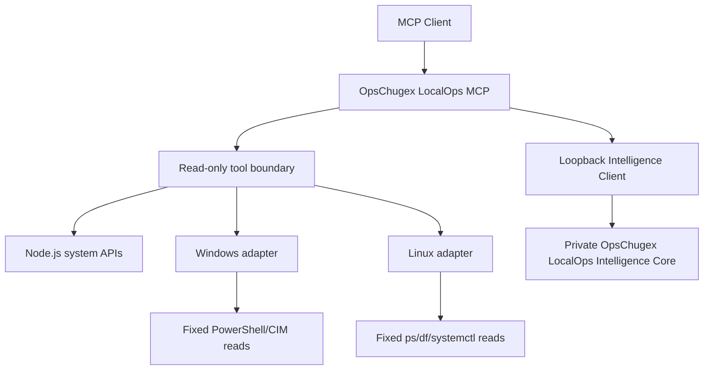

# OpsChugex LocalOps MCP

<!-- mcp-name: io.github.alexcgodwin/localops-mcp -->

[](https://github.com/alexcgodwin/localops-mcp/actions/workflows/ci.yml)
[](LICENSE)
[](server.json)

**Local Infrastructure, Endpoint & Systems Intelligence**

OpsChugex LocalOps MCP is a cross-platform Model Context Protocol server for safely inspecting local Windows and Linux systems. It is designed as the local/private-infrastructure counterpart to the Cloud DevOps MCP Server.

Version 2.0.0 adds an Operational Knowledge Graph & Guided Investigation layer while retaining Durable Incident Knowledge, structured search, case clustering, recurrence analysis, Cross-Node Incident Correlation, Predictive Health Intelligence and the existing approval-gated remediation, topology, database, and storage/backup capabilities. LocalOps can build bounded graphs linking retained cases to normalized signals, tags, cause categories, outcomes and resolution categories, trace relationship paths between incidents, look up cases by graph entity, and generate ordered non-mutating investigation steps from current and historical evidence. Graph paths and similarity remain descriptive evidence, not probability, causation or remediation authorization.

## Why this exists

Cloud operations tools can see cloud resources, deployments and managed services. They often cannot explain what is happening inside a workstation, private server or endpoint.

LocalOps starts at the operating-system layer:

- host and operating-system discovery
- CPU, memory and disk pressure
- network interface inventory
- bounded process inspection
- Windows service and systemd service inspection
- installed software and version inventory
- local users, groups and administrator membership
- startup program and scheduled-task metadata
- certificate and certificate-expiry inventory
- SSH key metadata without key contents
- environment-variable names without values
- local listening ports and active connection evidence
- routing, DNS and firewall configuration summaries
- adapter and ARP/neighbor-cache inventory
- process-to-network mapping without packet contents
- caller-baseline checks for unexpected listeners and outbound endpoints
- bounded Windows Event Log and Linux journal evidence
- login success/failure evidence where the host audit source permits it
- service, account, privileged-group and scheduler change evidence
- Microsoft Defender operational evidence on Windows
- explicit evidence-gap reporting when permissions or audit configuration are insufficient
- caller-baseline service-change detection
- disabled-by-default controlled execution gateway
- exact service allowlisting for service mutations
- five-minute one-time approval tokens
- post-action verification and in-memory audit records
- bounded evidence bundles for private correlation
- authenticated loopback-only private intelligence interface
- process, service, identity, network and persistence correlation
- chronological incident evidence timelines
- evidence-backed probable-cause ranking
- evidence-confidence scoring with source-limit penalties
- root-cause evidence chains
- read-only investigation paths
- temporal change-trigger identification
- local/evidence-based blast-radius analysis
- advisory remediation recommendations with risk tiers
- private evidence-based remediation workflow planning
- ordered validation-before-mutation workflow gates
- workflow-bound one-time approval tokens that cannot use the generic execution path
- durable execution-audit correlation with workflow and step identifiers
- post-action verification before a controlled remediation step is marked verified
- R3+ remediation retained as manual-only workflow guidance
- bounded per-node health history retained in memory for predictive analysis
- CPU, memory and disk trend extrapolation over a 1-168 hour horizon
- evidence-confidence scoring based on observation coverage rather than failure probability
- explicit insufficient-data results instead of fabricated forecasts
- warning/critical resource-threshold ETA without automatic remediation
- cross-node correlation of repeated health, resource, service and security-change evidence
- bounded fleet incident timeline anchored to snapshot capture times
- shared-cause hypothesis ranking with evidence-confidence limits
- incident-scope classification across affected nodes and common tags
- bounded incident fingerprints retained for current-process case memory
- incident-case comparison using normalized evidence overlap
- possible/strong recurrence detection without causal claims
- history summaries for repeated signals, tags and cause categories
- optional durable incident persistence across LocalOps process restarts
- structured operator-confirmed incident outcomes without command or free-form remediation storage
- historical resolution-pattern summaries from resolved/mitigated cases
- evidence-overlap resolution history for selected cases without prescriptive recommendations
- structured incident knowledge search across signals, tags, severity, scope and recorded outcomes
- nearest historical case retrieval using normalized fingerprint overlap
- threshold-connected incident case clustering with bounded cluster summaries
- bounded operational knowledge graphs across incident cases and normalized evidence entities
- graph relationship tracing between current and historical incidents
- exact entity-to-case lookup for signals, tags, causes, outcomes and resolution categories
- guided non-mutating incident investigation plans built from current and historical evidence
- bounded local fleet snapshots without raw event-log storage
- in-memory node registration and snapshot freshness tracking
- fleet health and inventory summaries
- explicit-baseline node comparison
- configuration, software, patch, certificate and security drift
- local Hyper-V, VirtualBox, Proxmox, libvirt and VMware CLI inventory where available
- exact local VM-state lookup without mutation
- local storage capacity and bounded storage-health evidence
- local Windows battery/UPS or Linux UPower telemetry
- private network-device health from caller-supplied snapshots
- private topology components, isolated nodes, down links and articulation/dependency concentration
- shortest dependency-path analysis across submitted private-infrastructure graphs
- source-to-target single-link and intermediate-node redundancy analysis
- topology failure-domain connectivity-loss analysis
- bounded what-if network change-impact simulation without executing a change
- named database profiles without credential exposure
- PostgreSQL, MySQL/MariaDB, SQL Server and Redis read-only telemetry
- normalized database inventory, connection, capacity, replication, lock and workload-pressure evidence
- private database health, replication, contention and pressure reasoning
- named local backup profiles without arbitrary MCP-supplied paths
- bounded backup artifact inventory, age, size and recent-volume evidence
- backup freshness and retention checks
- non-destructive newest-artifact metadata/readability validation
- point-in-time storage-growth comparison from a caller-supplied baseline
- backup-root filesystem capacity evidence
- RPO/RTO and restore-verification evidence
- private backup snapshot health, recovery readiness and risk correlation
- normalized Windows/Linux outputs
- explicit R0-R2 safety boundaries with R3+ blocked

The long-term goal is evidence correlation across endpoints, private infrastructure, networking, storage and virtualization while keeping advanced OpsChugex intelligence proprietary.

## v2.0 tools

| Tool | Purpose |
| --- | --- |
| `system_info` | Host, OS, architecture, CPU count and uptime |
| `system_health` | CPU, memory and disk pressure summary |
| `cpu_status` | Sample CPU utilization and processor metadata |
| `memory_status` | Physical memory usage |
| `disk_status` | Fixed-disk capacity and utilization |
| `network_interfaces` | Local adapters and assigned addresses |
| `list_processes` | Bounded process inventory without command lines |
| `inspect_process` | Inspect one process by PID |
| `list_services` | Windows services or systemd units |
| `service_status` | Inspect one validated service name |
| `uptime` | System uptime in seconds, hours and days |
| `installed_software` | Bounded installed-software inventory with versions |
| `software_versions` | Look up versions for requested installed software |
| `software_changes` | Compare current software with a caller-supplied baseline |
| `local_users` | Local account metadata without credentials |
| `local_groups` | Local group metadata and Linux group membership |
| `local_admins` | Built-in Windows administrators or common Linux admin groups |
| `startup_programs` | Startup registration metadata without command lines |
| `scheduled_tasks` | Scheduled-task/timer metadata without action commands |
| `certificate_inventory` | Certificate metadata without private key material |
| `certificate_expiry` | Expired or soon-to-expire certificate evidence |
| `ssh_key_inventory` | SSH-directory file metadata without key contents |
| `environment_variables_summary` | Environment-variable names and sensitivity flags without values |
| `open_ports` | Unique local TCP/UDP listening endpoints without remote scanning |
| `listening_ports` | Local TCP listeners and UDP endpoints with owner metadata |
| `network_connections` | Bounded local TCP/UDP socket state without packet capture |
| `network_routes` | Local routing table |
| `dns_configuration` | Configured DNS servers and search domains |
| `dns_resolution` | Resolve one validated host through the OS resolver |
| `firewall_status` | Local firewall provider/profile state |
| `firewall_rules` | Bounded read-only firewall-rule summary |
| `network_adapters` | Local adapter and link-state inventory |
| `arp_neighbors` | Local ARP/neighbor-cache evidence without active probing |
| `process_network_map` | Group observed sockets by owning process |
| `unexpected_listening_ports` | Compare listeners with a caller-supplied port baseline |
| `unusual_outbound_connections` | Compare active TCP remotes with caller-supplied expectations |
| `windows_event_logs` | Bounded Windows event evidence from an allowlisted log set |
| `linux_journal_logs` | Bounded Linux journal evidence with optional unit/priority filters |
| `security_events` | Supported security-relevant event evidence with audit limitations |
| `login_events` | Successful login/session evidence where available |
| `failed_logins` | Failed authentication evidence where available |
| `service_install_events` | Windows service-install or bounded Linux service-change evidence |
| `account_creation_events` | Local account-creation evidence |
| `admin_group_changes` | Privileged-group membership change evidence |
| `process_creation_events` | Audited Windows process-creation evidence; Linux remains unknown without an explicit audit source |
| `task_scheduler_events` | Scheduled-task/timer event evidence |
| `defender_events` | Microsoft Defender Operational evidence on Windows |
| `recent_system_changes` | Deterministic aggregation of supported system-change evidence |
| `recent_security_changes` | Deterministic aggregation of supported security-change evidence |
| `detect_new_services` | Compare current service names with a caller-supplied baseline |
| `execution_status` | Show execution enablement, allowlist and v0.5 risk-policy state |
| `propose_execution` | Run preflight and issue a five-minute one-time approval token without executing |
| `execute_approved_action` | Execute exactly the action bound to a valid approval token |
| `execution_audit_log` | Read recent in-memory execution audit records without approval tokens |
| `remediation_workflow_status` | Show v1.4 workflow safety state, current execution gates and retained workflow summaries |
| `create_remediation_workflow` | Build an ordered evidence-based remediation workflow without creating an approval or executing a change |
| `remediation_workflow_details` | Read one workflow's steps, gates, status and token-free event history |
| `record_remediation_step` | Record validation/manual completion or explicitly skip an eligible step without host mutation |
| `prepare_remediation_step` | Create a workflow-bound five-minute R2 approval proposal after earlier validation is resolved |
| `execute_approved_remediation_step` | Execute exactly one matching prepared R2 step through the existing controlled gateway and post-action verification |
| `intelligence_status` | Check whether the private loopback intelligence core is configured and reachable |
| `correlate_process_activity` | Correlate bounded process, event and network evidence through the private core |
| `correlate_service_activity` | Correlate service, process, event and network relationships |
| `correlate_identity_activity` | Correlate local identity, admin and authentication/change evidence |
| `correlate_network_activity` | Correlate process-to-remote-endpoint relationships without packet capture |
| `correlate_persistence_signals` | Correlate startup, scheduled-task, service, process and event evidence |
| `build_incident_timeline` | Build a chronological evidence timeline while preserving source limitations |
| `rank_probable_causes` | Rank evidence-backed operational hypotheses through the private core |
| `calculate_confidence` | Measure evidence coverage/confidence without treating it as compromise probability |
| `build_evidence_chain` | Build ordered supporting evidence chains for leading hypotheses |
| `suggest_investigation_path` | Generate an evidence-first, read-only investigation sequence |
| `identify_change_trigger` | Identify the earliest supported timestamped change as a temporal starting point |
| `identify_blast_radius` | Summarize local entities and observed network relationships tied to leading hypotheses |
| `recommend_remediation` | Return advisory risk-tiered remediation options without authorizing execution |
| `capture_node_snapshot` | Capture a bounded normalized snapshot of the current local host |
| `register_node` | Upsert one snapshot into the local in-memory fleet registry |
| `list_nodes` | List registered node metadata and snapshot freshness |
| `node_health` | Show health and freshness for one registered node |
| `node_health_history` | Return up to 96 retained in-memory CPU, memory and disk health observations for one node |
| `node_predictive_health` | Analyze one node's retained health trend over a bounded 1-168 hour horizon through the private core |
| `fleet_predictive_health` | Analyze retained health trends across registered nodes without triggering remediation |
| `fleet_incident_correlation` | Correlate repeated health, resource, service and security-change evidence across registered nodes |
| `fleet_incident_timeline` | Build a bounded cross-node snapshot timeline without claiming original event timestamps |
| `fleet_shared_cause_analysis` | Rank evidence-backed shared-cause hypotheses without treating confidence as causation probability |
| `fleet_incident_scope` | Classify observed impact as none, localized, multi-node or fleet-wide |
| `capture_incident_case` | Capture and retain a normalized incident fingerprint from the current registered fleet |
| `list_incident_cases` | List bounded metadata for incident cases retained by the current LocalOps process |
| `incident_case_details` | Read one stored incident fingerprint by case ID |
| `compare_incident_cases` | Compare two stored cases by normalized evidence overlap through the private core |
| `incident_recurrence_analysis` | Find possible or strong recurrence patterns across retained incident fingerprints |
| `incident_history_summary` | Summarize repeated incident signals, tags, cause categories, severity and scope |
| `incident_memory_status` | Show case/outcome counts and whether optional durable local incident persistence is enabled |
| `record_incident_outcome` | Store a structured operator-confirmed outcome category/status for one case |
| `incident_resolution_patterns` | Summarize historical outcome categories and repeated evidence patterns through the private core |
| `incident_resolution_history` | Find evidence-overlapping prior resolved/mitigated cases and show their recorded outcomes |
| `incident_knowledge_search` | Search retained cases with bounded structured evidence and outcome criteria |
| `incident_case_neighbors` | Rank nearest retained cases by normalized fingerprint overlap |
| `incident_case_clusters` | Group retained cases into bounded threshold-connected similarity clusters |
| `operational_knowledge_graph` | Build a bounded graph linking incident cases to normalized evidence and similarity relationships |
| `incident_knowledge_trace` | Trace bounded graph paths from one incident to related historical cases |
| `incident_entity_cases` | Find retained cases linked to one exact signal, tag, cause, outcome or resolution entity |
| `guided_incident_investigation` | Build an ordered read-only investigation plan from current and historical evidence |
| `fleet_health` | Summarize health, stale snapshots and node states across the registry |
| `fleet_inventory` | Return bounded fleet metadata without raw event logs |
| `compare_nodes` | Compare two registered snapshots through the private core |
| `configuration_drift` | Compare host, service, startup and scheduler state against an explicit baseline |
| `software_drift` | Compare installed-software presence and versions against an explicit baseline |
| `patch_drift` | Compare Windows hotfix or Linux kernel/package patch markers |
| `certificate_drift` | Compare certificate presence and expiry metadata |
| `security_drift` | Compare local-admin and summarized security-change evidence |
| `virtual_machine_inventory` | Inspect locally available Hyper-V, VirtualBox, Proxmox, libvirt or VMware CLI inventory |
| `vm_health` | Inspect one exact local VM ID/name and report observed provider state |
| `storage_capacity` | Summarize local fixed-filesystem capacity and utilization |
| `storage_health` | Combine filesystem utilization with supported local physical-disk health evidence |
| `ups_health` | Read locally exposed Windows battery/UPS or Linux UPower telemetry |
| `network_device_health` | Analyze bounded caller-supplied private-device snapshots through the private core |
| `private_network_topology` | Analyze caller-supplied private-infrastructure nodes/links without discovery or probing |
| `network_dependency_path` | Find the shortest submitted non-down dependency path between two explicit devices |
| `network_path_redundancy` | Check source-to-target tolerance to one primary-path link or intermediate-node loss |
| `network_failure_domains` | Measure node and non-parallel active-link connectivity-loss impact across the submitted graph |
| `network_change_impact` | Run a bounded what-if connectivity simulation for explicitly unavailable nodes or endpoint-pair links |
| `platform_status` | Show v1.0 transport, process-bound identity/role, execution state, durable-audit state and private-core reachability |
| `policy_status` | Show RBAC permissions and the enforced R0-R3+ boundary |
| `evaluate_policy` | Evaluate one operation/risk tier without executing anything |
| `production_readiness` | Check runtime, RBAC, execution/audit coherence, data-directory safety and private-core reachability |
| `production_audit_log` | Read metadata-only durable execution audit records when enabled |
| `database_profiles` | List configured database profile metadata without password values or secret-environment names |
| `database_snapshot` | Collect a bounded normalized read-only snapshot using fixed engine telemetry queries |
| `database_health` | Analyze operational database health through the private intelligence core |
| `database_capacity` | Return database-size or memory-capacity evidence without inventing free-space risk |
| `database_connection_summary` | Return bounded active/total/max/blocked connection evidence |
| `database_replication_health` | Analyze replication role/state/lag evidence without assuming standalone databases are unhealthy |
| `database_lock_summary` | Analyze waiting-lock/blocked-connection contention without terminating transactions |
| `database_query_pressure` | Analyze connection utilization and workload-pressure evidence without collecting query text |
| `backup_profiles` | List named backup-profile metadata; arbitrary MCP-supplied paths are not accepted |
| `backup_snapshot` | Collect normalized backup inventory, freshness, retention, restore-point, capacity and recovery-objective evidence |
| `backup_inventory` | Return bounded backup file-count, size and age evidence without reading backup contents |
| `backup_freshness` | Compare the newest artifact with the configured expected interval and RPO |
| `backup_restore_point_validation` | Validate newest-artifact presence, non-zero size and read access without executing a restore |
| `backup_retention` | Report bounded artifacts older than the configured retention target without deleting them |
| `backup_storage_growth` | Compare current inventory totals with an explicit caller-supplied prior baseline |
| `backup_snapshot_health` | Analyze normalized backup health through the private intelligence core |
| `backup_recovery_readiness` | Analyze restore-point, RPO, RTO and restore-verification evidence without executing a restore |
| `backup_risk_correlation` | Correlate freshness, capacity, retention, restore-point and recovery-objective risk signals |

## Architecture



The public MCP owns protocol handling, safe collectors, normalized node/fleet/infrastructure/database/backup schemas, bounded topology/remediation/predictive/cross-node/incident-memory contracts, fixed read-only database adapters, bounded local backup metadata collection, local virtualization/storage/power adapters, the in-memory fleet registry, bounded node-health history and bounded normalized incident-case memory, process-bound RBAC/policy enforcement, workflow state, one-time execution approvals, optional durable audit storage, the loopback client and operator-facing tools. The private OpsChugex intelligence core owns correlation, root-cause ranking, fleet drift, cross-node incident correlation, incident fingerprinting, recurrence/similarity analysis, shared-cause ranking and scope analysis, private device-health/topology reasoning, dependency-path/redundancy/failure-domain/change-impact algorithms, database health/replication/contention/pressure analysis, backup snapshot-health/recovery-readiness/risk correlation, remediation workflow planning/gate reasoning, and predictive-health trend/threshold analysis.

## Quickstart

Requirements:

- Node.js 20 or newer
- Windows 10/11 or a modern Linux distribution
- PowerShell on Windows
- `ps`, `df` and systemd tools for the relevant Linux collectors

Clone and run:

```bash
git clone https://github.com/alexcgodwin/localops-mcp.git
cd localops-mcp
npm install
npm run build
npm test
npm start
```

For development:

```bash
npm run dev
```

### Optional private intelligence core

The correlation, root-cause, private fleet, private-infrastructure, database, backup, network-topology, remediation-planning, predictive-health, cross-node incident, recurrence, resolution and v1.9 knowledge-search/clustering tools require the private OpsChugex LocalOps Intelligence Core to be running locally. Configure the public MCP process with:

```text
LOCALOPS_INTELLIGENCE_URL=http://127.0.0.1:43123
LOCALOPS_INTELLIGENCE_TOKEN=<private token of at least 32 characters>
```

The public client rejects non-loopback intelligence URLs. If the private core is not configured or running, local collection and policy/readiness tools continue to work and private-analysis tools report the limitation.

### v1.0 production controls

The local stdio process uses process-bound RBAC:

```text
LOCALOPS_ROLE=viewer|operator|maintainer|admin
LOCALOPS_OPERATOR_ID=<local operator/process identity>
LOCALOPS_AUDIT_PERSISTENCE=true|false
LOCALOPS_DATA_DIR=<optional absolute non-root directory>
```

The default role is `viewer`. `operator` may create R2 proposals, while `maintainer` and `admin` may execute an otherwise valid R2 approval. R3+ execution remains unavailable. Durable audit is optional for read-only deployments but `production_readiness` reports execution without durable audit as blocked.

### v1.1 database profiles

Database tools use named profiles from `LOCALOPS_DATABASE_PROFILES`. Profiles contain connection metadata only. Password values are referenced through separate environment variables and are never accepted as MCP tool arguments.

Example:

```text
LOCALOPS_DATABASE_PROFILES=[{"id":"pg-main","engine":"postgresql","host":"127.0.0.1","port":5432,"database":"app","user":"localops_reader","passwordEnv":"LOCALOPS_DB_PG_MAIN_PASSWORD","tls":true}]
LOCALOPS_DB_PG_MAIN_PASSWORD=<secret value>
```

Supported engines are `postgresql`, `mysql` (including MariaDB-compatible telemetry), `sqlserver`, and `redis`.

SQL Server may use `"integratedAuth":true` instead of a password environment variable. Database profile parsing is included in `production_readiness`.

### v1.2 backup profiles

Storage and backup tools use named local roots from `LOCALOPS_BACKUP_PROFILES`. MCP callers provide only a profile ID; they cannot supply an arbitrary filesystem path.

Example:

```text
LOCALOPS_BACKUP_PROFILES=[{"id":"app-nightly","rootPath":"/srv/backups/app","kind":"database-dump","extensions":[".bak",".zip"],"expectedIntervalHours":24,"retentionDays":30,"rpoHours":24,"rtoMinutes":120,"lastVerifiedRestoreAt":"2026-10-01T20:00:00Z","lastRestoreDurationMinutes":45}]
```

On Windows, use an absolute Windows path with valid JSON escaping. `lastVerifiedRestoreAt` and `lastRestoreDurationMinutes` are operator-supplied evidence from an earlier restore test. LocalOps does not execute a restore to populate them. Backup profile parsing is included in `production_readiness`.

### v1.4 remediation workflows

A v1.4 remediation workflow is a bounded, in-memory orchestration record created from current LocalOps evidence and the current execution-policy state. Workflows expire after 30 minutes and at most 100 are retained.

The workflow sequence is intentionally split:

1. create a plan from bounded evidence
2. complete required validation steps
3. prepare one fixed R2 step, which creates a five-minute one-time approval token
4. execute that exact workflow/step only with `confirmation="APPROVE"`
5. require post-action verification before the step is marked verified

Workflow execution requires `LOCALOPS_EXECUTION_ENABLED=true`, the existing role/allowlist checks, and `LOCALOPS_AUDIT_PERSISTENCE=true`. Raw approval tokens are never stored in workflow state or audit records. R3+ steps are guidance only and cannot be executed by LocalOps.

### v1.5 predictive health

Every successful `register_node` call with health metrics contributes one timestamped observation to that node's bounded in-memory history. Duplicate capture timestamps replace the earlier observation, histories are capped at 96 entries per node, and all history disappears when the LocalOps process exits.

`node_predictive_health` and `fleet_predictive_health` send only the bounded normalized history to the loopback private core. The selected forecast horizon is restricted to 1-168 hours. At least three distinct observations spanning at least one hour are required; otherwise LocalOps returns `insufficient-data`.

The private core estimates linear CPU, memory and disk trends and compares them with the same LocalOps warning/critical resource thresholds. Evidence confidence measures history coverage only. It is not a probability of failure, hardware-health guarantee, capacity commitment, or authorization to remediate.

### v1.6 cross-node incident correlation

`fleet_incident_correlation`, `fleet_incident_timeline`, `fleet_shared_cause_analysis` and `fleet_incident_scope` send only the bounded registered fleet snapshot bundle to the authenticated loopback private core. The core looks for repeated health pressure, shared service problem states, repeated security-change categories and common resource pressure across nodes.

The incident timeline is intentionally coarse: entries are anchored to each node's snapshot capture time because raw cross-node event streams are not stored in the fleet registry. Shared-cause outputs are hypotheses ranked by evidence coverage, not proof or probability of causation. Incident-scope results describe the current observed footprint only.

### v1.7 incident memory and recurrence

`capture_incident_case` asks the private core to reduce the current registered fleet evidence into a normalized fingerprint, then retains that fingerprint in a bounded 200-case in-memory registry. The fingerprint contains signal IDs/categories, affected node IDs, common tags, cause categories, scope, severity and a stable signature. It does not contain raw event logs, packet contents, credentials, command output or approval tokens.

`compare_incident_cases` and `incident_recurrence_analysis` compare normalized fingerprint tokens. Similarity is expressed as evidence overlap and classified as none, weak, possible or strong. Those labels support investigation only; they are not probabilities and do not establish that two incidents share the same root cause.

`incident_history_summary` reports repeated signals, tags and cause categories plus bounded severity/scope counts. Without v1.8 persistence, incident memory remains process-local.

### v1.8 durable incident knowledge and resolution intelligence

Set `LOCALOPS_INCIDENT_PERSISTENCE=true` to persist the bounded 200-case normalized registry to `incident-memory.json` under `LOCALOPS_DATA_DIR` (or the default LocalOps data directory). The file is written atomically and restrictive filesystem permissions are applied where supported. Persistence is disabled by default.

`record_incident_outcome` stores only fixed status/category metadata, verification state, operator ID and an optional bounded duration. It does not accept shell commands, arbitrary remediation text, credentials or approval tokens.

`incident_resolution_patterns` summarizes operator-confirmed resolved/mitigated cases by resolution category and repeated normalized evidence. `incident_resolution_history` finds prior resolved/mitigated cases with fingerprint overlap. Both are historical context only: they do not prescribe an action, prove causation or authorize execution.

### v1.9 incident knowledge search and case clustering

`incident_knowledge_search` accepts only bounded structured criteria: signal IDs, tags, cause categories, severity, scope, outcome status and resolution category. It ranks retained cases by how much of the supplied query criteria each case covers. The match percentage is query coverage, not semantic confidence, probability or proof of causation.

`incident_case_neighbors` ranks the nearest historical cases to one selected case using Jaccard overlap of normalized fingerprint tokens. `incident_case_clusters` groups cases connected by a caller-selected 1-100 similarity threshold and returns bounded cluster summaries, common evidence and recorded outcome categories. Cluster membership is descriptive; threshold-connected groups can contain indirectly linked cases.

All v1.9 retrieval stays inside the authenticated loopback private core. No external vector database, embedding API, arbitrary text query, raw log search, packet inspection or new execution path is introduced.

### v2.0 operational knowledge graph and guided investigation

`operational_knowledge_graph` links up to 200 supplied incident cases to normalized signal, tag, cause, outcome and resolution nodes, plus case-to-case similarity edges above a caller-selected threshold. The graph is bounded to at most 1,200 nodes and 4,000 edges and reports truncation when those limits are reached.

`incident_knowledge_trace` performs bounded graph traversal from one case to related historical cases with a maximum depth of four and at most 20 returned paths. `incident_entity_cases` performs exact normalized entity lookup for one signal, tag, cause, outcome or resolution value.

`guided_incident_investigation` creates an ordered five-step read-only investigation plan using the selected case, shared evidence and related historical outcomes. The plan never contains executable shell commands, never creates an approval token, and never authorizes remediation.

## Safety model

v2.0 keeps the existing controlled-execution, remediation, predictive, cross-node, recurrence and durable-knowledge boundaries while adding bounded graph reasoning and guided investigation. Graph and investigation results are analysis only and cannot authorize execution:

```text
R0 READ                     allowed
R1 ANALYZE / EVIDENCE       allowed
R2 BOUNDED EXECUTION         disabled by default; explicit approval required
R3+ HIGHER-RISK EXECUTION    not exposed
PRIVATE INTELLIGENCE          loopback-only, authenticated, analysis-only
FLEET SNAPSHOTS               bounded, in-memory, no remote control
PRIVATE INFRASTRUCTURE         local reads + caller-supplied snapshots only
RBAC / POLICY                  process-bound, enforced for execution
DURABLE AUDIT                  optional generally; required for v1.4 workflow execution
DATABASE INTELLIGENCE          fixed read-only queries, named profiles only
STORAGE / BACKUP INTELLIGENCE  bounded metadata, named local profiles only
NETWORK TOPOLOGY INTELLIGENCE  bounded submitted graphs, analysis-only
REMEDIATION WORKFLOWS           ordered planning + approval orchestration; no auto-authorization
PREDICTIVE HEALTH                bounded in-memory history + private trend analysis; no execution
CROSS-NODE INCIDENT               bounded registered snapshots + private correlation; no execution
INCIDENT KNOWLEDGE                 max 200 normalized cases; optional local persistence; no raw logs or execution
OPERATIONAL KNOWLEDGE GRAPH         max 1200 nodes / 4000 edges; read-only relationship analysis
```

Important controls:

- no arbitrary command tool
- no arbitrary PowerShell or shell input
- no environment-variable values
- no SSH key contents or private-key reads
- no scheduled-task action commands
- no startup command lines
- no process command-line collection
- no remote port scanning
- no packet capture or packet payload inspection
- no firewall changes
- "unexpected", "outside baseline" and "new" mean only that caller-supplied expectations did not match
- no event-log clearing or retention changes
- no audit-policy changes
- event messages are bounded and secret-like values are redacted
- inaccessible logs and missing audit coverage are reported as evidence limitations rather than interpreted as clean
- execution is disabled unless `LOCALOPS_EXECUTION_ENABLED=true`
- least-privileged default role is `viewer`
- R2 proposals require `operator`, `maintainer`, or `admin`
- R2 execution requires `maintainer` or `admin`
- durable audit records contain execution metadata only, never approval tokens or command output
- `production_readiness` blocks a production-ready result when execution is enabled without durable audit
- service actions require the exact service name in `LOCALOPS_ALLOWED_SERVICES`
- proposals perform preflight but do not execute
- approval tokens expire after five minutes and are one-time use
- execution requires `confirmation="APPROVE"`
- service allowlisting is checked again immediately before execution
- temporary cleanup is restricted to old regular files inside the OS temp directory, with bounded age/count controls
- R3+ actions are intentionally absent from the public server
- private intelligence URL is restricted to explicit loopback addresses
- private-core authentication requires a token of at least 32 characters
- private API routes are allowlisted in the public client
- correlation requests contain bounded normalized evidence, not arbitrary commands
- private-core connection errors do not echo authentication material
- correlation reports relationships and evidence gaps
- root-cause rankings are hypotheses, not definitive verdicts
- evidence confidence measures collection coverage/alignment, not compromise probability
- change triggers are temporal starting points, not proof of causation
- blast radius is bounded to observed local entities and network relationships
- remediation recommendations never authorize execution
- v1.4 workflow creation does not create an approval token or execute a host change
- required validation steps cannot be skipped before a later controlled R2 step is prepared
- v1.4 workflow execution requires durable audit persistence in addition to the existing execution/RBAC/allowlist gates
- raw workflow approval tokens are never stored; workflow state keeps only a SHA-256 token binding
- workflow-bound approval tokens can be consumed only through the matching workflow and step, not through the generic execution tool
- each controlled workflow step still requires a fresh five-minute one-time token and exact `APPROVE` confirmation
- a controlled workflow step is marked verified only after post-action verification succeeds
- workflow state is in-memory, capped at 100 retained workflows and expires after 30 minutes
- R3+ remediation stays manual and is never mapped to an executable workflow action
- no workflow silently authorizes, chains or executes multiple host mutations
- predictive health history is in-memory only, capped at 96 observations per node, and contains normalized health/resource metrics rather than raw event logs
- predictive horizons are bounded to 1-168 hours
- at least three distinct observations spanning at least one hour are required before a directional forecast is considered defensible
- evidence confidence measures observation count/time-span coverage, not failure probability
- predictive analysis uses linear trend extrapolation and explicitly reports that it does not model workload schedules, seasonality, deployments or hardware failure mechanisms
- predictive results never authorize or trigger remediation
- the private predictive API exposes analysis only; no predictive execution route exists
- cross-node analysis uses only bounded registered snapshots and does not collect distributed traces, packet contents or synchronized raw event streams
- repeated evidence across nodes is treated as correlation, not verified causation
- shared-cause evidence confidence measures cross-node coverage and is not a probability that a hypothesis is the cause
- cross-node timelines are anchored to snapshot capture time and explicitly disclose timing limitations
- v1.6 cross-node routes are analysis-only and expose no execution endpoint
- incident memory is capped at 200 normalized cases; persistence is disabled by default and enabled only with `LOCALOPS_INCIDENT_PERSISTENCE=true`
- durable incident state is restricted to the LocalOps data directory and uses atomic replacement plus restrictive permissions where supported
- incident fingerprints and outcomes exclude raw event logs, packet data, credentials, command output and approval tokens
- outcome recording uses fixed status/category fields rather than arbitrary remediation commands or notes
- incident similarity measures normalized evidence overlap and is not recurrence probability or causal proof
- historical resolution patterns describe recorded outcomes and are not recommendations for a future incident
- v1.8 private incident routes are authenticated, loopback-only, analysis-only and expose no execution endpoint
- v1.9 search accepts only bounded structured criteria and does not expose arbitrary text, regex, SQL, shell or raw-log query input
- v1.9 neighbor and cluster similarity uses normalized fingerprint overlap and is not probability or causal confidence
- clustering is bounded to at most 200 supplied cases and returns at most 50 cluster summaries
- threshold-connected clusters can include indirectly linked cases and explicitly disclose that limitation
- no external embedding, vector database or third-party search service receives incident knowledge
- v1.9 private retrieval routes are authenticated, loopback-only, analysis-only and expose no execution endpoint
- v2.0 graph input is limited to the same bounded normalized incident cases already retained by LocalOps
- v2.0 graph construction is bounded to 1,200 nodes and 4,000 edges and explicitly reports truncation
- v2.0 tracing is bounded to depth 4 and 20 paths; graph paths are investigation aids, not causal proof
- v2.0 entity lookup accepts one exact normalized value and returns at most 50 cases
- guided investigation returns non-mutating evidence-review steps only and never returns executable commands or approval tokens
- `/v2/knowledge/execute` is not allowlisted by the public client and no v2 execution endpoint exists
- fleet snapshots contain summarized security-change categories/counts, not raw event messages
- fleet registry is in-memory only and capped at 500 nodes
- registering a snapshot records caller-supplied node evidence; it does not authenticate or attest the identity of that node
- fleet drift requires an explicitly selected baseline node
- stale snapshots and large capture-time skew are surfaced as evidence limitations
- fleet drift means difference, not automatically error, unauthorized change or compromise
- no SSH, WinRM, remote shell, credential storage or lateral execution
- no automatic cross-node remediation
- no subnet discovery, remote device login or credential collection
- no SNMP writes or remote management mutation
- no hypervisor VM start/stop/create/delete actions
- no storage mutation, formatting or filesystem changes
- private-infrastructure snapshots do not authenticate or attest device identity
- topology is derived only from submitted nodes/links and is not active discovery
- articulation nodes indicate dependency concentration in submitted topology, not guaranteed production single points of failure
- v1.3 dependency paths use only submitted non-down links; unknown-state links may reduce certainty
- path redundancy simulates one primary-path link or intermediate-node loss at a time and does not verify physical path diversity
- failure-domain results describe graph connectivity impact, not guaranteed application outage
- change-impact analysis is what-if only and does not execute network changes
- endpoint-pair change simulation disables all submitted links between those endpoints
- no subnet scanning, remote login, route mutation, firewall mutation, SNMP write, lateral execution or automatic network remediation is exposed
- database tools accept profile IDs only, not connection strings or arbitrary SQL
- database passwords are referenced through separate environment variables and are never returned in profile metadata
- fixed database telemetry queries do not collect application query text
- no INSERT, UPDATE, DELETE, DDL, transaction termination, failover or database-configuration mutation is exposed
- database health is operational evidence, not proof of data integrity, application correctness or compromise
- standalone or intentionally non-replicated databases are not automatically treated as unhealthy
- capacity values do not invent free disk space or growth risk when the engine does not expose those facts
- malformed database profile configuration is surfaced by production readiness
- backup tools accept configured profile IDs only, not arbitrary filesystem paths
- backup scans are bounded to 5,000 matching files and a maximum directory depth of 16
- symbolic links are not followed by the backup collector
- restore-point validation checks metadata, non-zero size and one-byte read access only; it does not execute or certify a restore
- backup growth uses an explicit caller-supplied prior baseline; LocalOps does not invent or persist trend history
- RPO/RTO results are evidence comparisons against configured objectives, not guarantees of recoverability
- restore-verification timestamps and durations are operator-supplied evidence from prior restore testing
- no backup restore, delete, prune, format or storage-mutation tool is exposed
- malformed backup profile configuration is surfaced by production readiness
- bounded list sizes
- strict PID validation
- strict service-name validation
- fixed executable/argument paths
- token/password/secret redaction in command errors and output
- no administrator/root requirement for normal Node.js collectors

Some platform collectors may require local permission to inspect specific processes or services. Permission failures are returned as errors rather than bypassed.

## Public/private boundary

This repository is the public implementation and portfolio-facing gateway.

The separate private **OpsChugex LocalOps Intelligence Core** implements correlation, root-cause intelligence, fleet drift, predictive-health trend/threshold analysis, cross-node incident correlation, incident fingerprinting, recurrence/similarity analysis, resolution-pattern and historical-resolution analysis, structured incident retrieval, nearest-case matching, similarity clustering, v2.0 operational knowledge-graph construction, relationship tracing and guided-investigation reasoning, shared-cause ranking and scope analysis, private device-health/topology reasoning, dependency-path/redundancy/failure-domain/change-impact analysis, database health/replication/contention/pressure analysis, backup snapshot-health/recovery-readiness/risk correlation, and remediation workflow planning.

The public repository contains safe collection, bounded snapshots, schemas, fixed read-only database adapters, bounded local backup metadata collectors, bounded topology/remediation/predictive/cross-node/incident-memory/search/knowledge-graph contracts, local infrastructure adapters, in-memory workflow/fleet/health-history state, optional durable normalized incident-case storage, structured outcome recording, policy enforcement, approval orchestration, audit integration and the loopback client. Proprietary correlation, incident fingerprinting, recurrence/similarity analysis, resolution-pattern analysis, structured retrieval ranking, neighbor matching, case clustering, knowledge-graph construction, relationship tracing, guided-investigation reasoning, shared-cause ranking, scope analysis, drift, topology, database-analysis, backup-risk, remediation-planning and predictive-health algorithms are not included in this MIT repository.

## Roadmap

| Version | Focus |
| --- | --- |
| 0.1 | System discovery, completed |
| 0.2 | Endpoint inventory, completed |
| 0.3 | Network intelligence, completed |
| 0.4 | Event and security evidence, completed |
| 0.5 | Approval-gated controlled execution, completed |
| 0.6 | Evidence correlation, completed |
| 0.7 | Root-cause intelligence, completed |
| 0.8 | Fleet intelligence, completed |
| 0.9 | Private infrastructure and virtualization, completed |
| 1.0 | Production LocalOps platform, completed |
| 1.1 | Database intelligence, completed |
| 1.2 | Storage and backup intelligence, completed |
| 1.3 | Network topology intelligence, completed |
| 1.4 | Automated remediation workflows, completed |
| 1.5 | Predictive health intelligence, completed |
| 1.6 | Cross-node incident correlation, completed |
| 1.7 | Incident memory and recurrence intelligence, completed |
| 1.8 | Durable incident knowledge and resolution intelligence, completed |
| 1.9 | Incident knowledge search and case clustering, completed |
| 2.0 | Operational knowledge graph and guided investigation, completed |

## Development principles

1. Prefer native OS APIs and fixed commands over generic shell execution.
2. Treat missing evidence as unknown, not as proof of safety or failure.
3. Keep collection separate from intelligence and remediation.
4. Normalize Windows and Linux responses into stable MCP schemas.
5. Require explicit policy and approval gates before future mutation features.
6. Keep proprietary intelligence outside the public repository.

## Relationship to Cloud DevOps MCP

**Cloud DevOps MCP Server** focuses on cloud infrastructure, Kubernetes, Terraform, CI/CD, observability and cloud operations.

**OpsChugex LocalOps MCP** focuses on the operating systems, endpoints, local servers and private infrastructure underneath them.

Together they form two separate operational planes rather than overlapping wrappers around the same services.

## Author

Built and maintained by **Alex C. Godwin** under the **OpsChugex** product brand.

## License

MIT. See [LICENSE](LICENSE).
