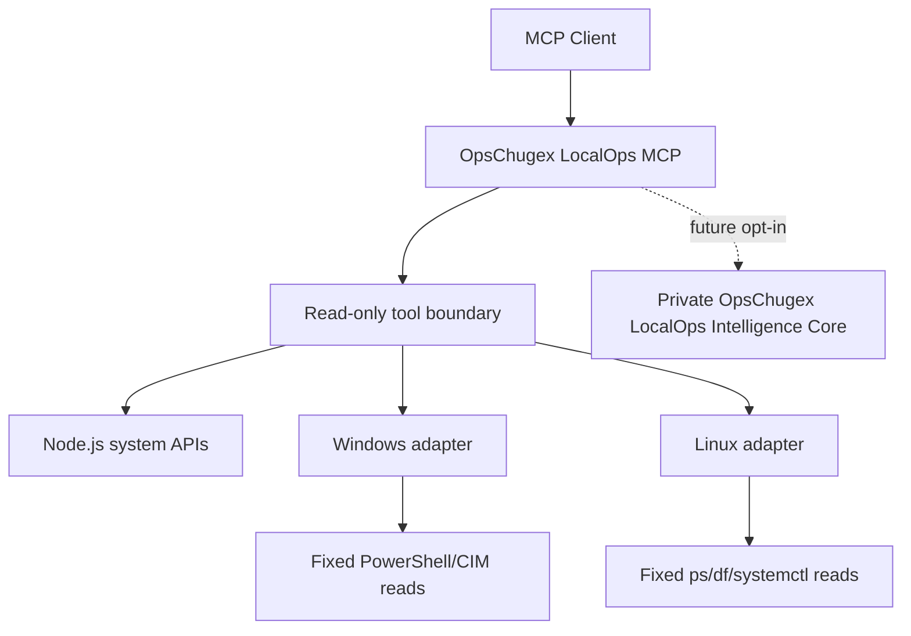

# OpsChugex LocalOps MCP

<!-- mcp-name: io.github.alexcgodwin/localops-mcp -->

[](https://github.com/alexcgodwin/localops-mcp/actions/workflows/ci.yml)
[](LICENSE)
[](server.json)

**Local Infrastructure, Endpoint & Systems Intelligence**

OpsChugex LocalOps MCP is a cross-platform Model Context Protocol server for safely inspecting local Windows and Linux systems. It is designed as the local/private-infrastructure counterpart to the Cloud DevOps MCP Server.

Version 0.2.0 remains intentionally read-only. In addition to system discovery, it adds endpoint inventory for installed software, local identities, startup registrations, scheduled tasks, certificates, SSH key metadata and environment-variable names. It does not provide arbitrary shell execution, process termination, service mutation, file deletion, credential reads, secret values, private-key contents, or remediation.

## Why this exists

Cloud operations tools can see cloud resources, deployments and managed services. They often cannot explain what is happening inside a workstation, private server or endpoint.

LocalOps starts at the operating-system layer:

- host and operating-system discovery
- CPU, memory and disk pressure
- network interface inventory
- bounded process inspection
- Windows service and systemd service inspection
- installed software and version inventory
- local users, groups and administrator membership
- startup program and scheduled-task metadata
- certificate and certificate-expiry inventory
- SSH key metadata without key contents
- environment-variable names without values
- normalized Windows/Linux outputs
- read-only MCP access with explicit safety boundaries

The long-term goal is evidence correlation across endpoints, private infrastructure, networking, storage and virtualization while keeping advanced OpsChugex intelligence proprietary.

## v0.2 tools

| Tool | Purpose |
| --- | --- |
| `system_info` | Host, OS, architecture, CPU count and uptime |
| `system_health` | CPU, memory and disk pressure summary |
| `cpu_status` | Sample CPU utilization and processor metadata |
| `memory_status` | Physical memory usage |
| `disk_status` | Fixed-disk capacity and utilization |
| `network_interfaces` | Local adapters and assigned addresses |
| `list_processes` | Bounded process inventory without command lines |
| `inspect_process` | Inspect one process by PID |
| `list_services` | Windows services or systemd units |
| `service_status` | Inspect one validated service name |
| `uptime` | System uptime in seconds, hours and days |
| `installed_software` | Bounded installed-software inventory with versions |
| `software_versions` | Look up versions for requested installed software |
| `software_changes` | Compare current software with a caller-supplied baseline |
| `local_users` | Local account metadata without credentials |
| `local_groups` | Local group metadata and Linux group membership |
| `local_admins` | Built-in Windows administrators or common Linux admin groups |
| `startup_programs` | Startup registration metadata without command lines |
| `scheduled_tasks` | Scheduled-task/timer metadata without action commands |
| `certificate_inventory` | Certificate metadata without private key material |
| `certificate_expiry` | Expired or soon-to-expire certificate evidence |
| `ssh_key_inventory` | SSH-directory file metadata without key contents |
| `environment_variables_summary` | Environment-variable names and sensitivity flags without values |

## Architecture



The public MCP owns protocol handling, safe collectors, normalization and community-visible integrations. Proprietary correlation, root-cause, risk and remediation decision logic belongs in the private OpsChugex intelligence core.

## Quickstart

Requirements:

- Node.js 20 or newer
- Windows 10/11 or a modern Linux distribution
- PowerShell on Windows
- `ps`, `df` and systemd tools for the relevant Linux collectors

Clone and run:

```bash
git clone https://github.com/alexcgodwin/localops-mcp.git
cd localops-mcp
npm install
npm run build
npm test
npm start
```

For development:

```bash
npm run dev
```

## Safety model

v0.2 follows a narrow read-only model:

```text
READ       allowed
ANALYZE    allowed
PLAN       future
EXECUTE    not exposed in v0.2
DESTRUCTIVE EXECUTION    not exposed in v0.2
```

Important controls:

- no arbitrary command tool
- no arbitrary PowerShell or shell input
- no environment-variable values
- no SSH key contents or private-key reads
- no scheduled-task action commands
- no startup command lines
- no process command-line collection
- bounded list sizes
- strict PID validation
- strict service-name validation
- fixed executable/argument paths
- token/password/secret redaction in command errors and output
- no administrator/root requirement for normal Node.js collectors

Some platform collectors may require local permission to inspect specific processes or services. Permission failures are returned as errors rather than bypassed.

## Public/private boundary

This repository is the public implementation and portfolio-facing gateway.

The separate private **OpsChugex LocalOps Intelligence Core** is reserved for future proprietary capabilities such as:

- evidence correlation
- incident timelines
- root-cause ranking
- confidence models
- anomaly detection
- risk evaluation
- remediation decision logic
- fleet-level intelligence

Those algorithms are not included in this MIT repository.

## Roadmap

| Version | Focus |
| --- | --- |
| 0.1 | System discovery, completed |
| 0.2 | Endpoint inventory, completed |
| 0.3 | Network intelligence |
| 0.4 | Event and security evidence |
| 0.5 | Approval-gated controlled execution |
| 0.6 | Evidence correlation |
| 0.7 | Root-cause intelligence |
| 0.8 | Fleet intelligence |
| 0.9 | Private infrastructure and virtualization |
| 1.0 | Production LocalOps platform |

## Development principles

1. Prefer native OS APIs and fixed commands over generic shell execution.
2. Treat missing evidence as unknown, not as proof of safety or failure.
3. Keep collection separate from intelligence and remediation.
4. Normalize Windows and Linux responses into stable MCP schemas.
5. Require explicit policy and approval gates before future mutation features.
6. Keep proprietary intelligence outside the public repository.

## Relationship to Cloud DevOps MCP

**Cloud DevOps MCP Server** focuses on cloud infrastructure, Kubernetes, Terraform, CI/CD, observability and cloud operations.

**OpsChugex LocalOps MCP** focuses on the operating systems, endpoints, local servers and private infrastructure underneath them.

Together they form two separate operational planes rather than overlapping wrappers around the same services.

## Author

Built and maintained by **Alex C. Godwin** under the **OpsChugex** product brand.

## License

MIT. See [LICENSE](LICENSE).
